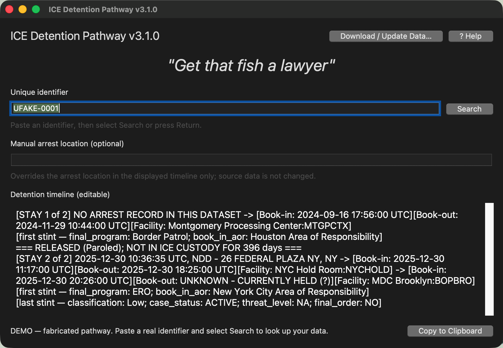

<p align="center">
  
</p>

<h1 align="center">ICE Detention Pathway</h1>

<p align="center">
  Reconstruct an anonymized person's recorded route through ICE custody — from
  arrest through every known detention-facility transfer.
</p>

<p align="center">
  <a href="https://github.com/remypicciano/ICE-Detention-Path-finder/actions/workflows/ci.yml"></a>
  
  
  
  
  
</p>

ICE Detention Pathway turns linked Parquet records from the
[Deportation Data Project](https://deportationdata.org/data/processed/ice.html)
into a readable chronology. Give it a `unique_identifier`, `stay_ID`, or
`stint_ID`; it finds every recorded stay, pairs each with the arrest that opened
it, and orders the detention stints inside each stay by book-in time, resolving
facility codes to canonical names.

A person may be detained more than once. Separate stays are reported separately,
never chained into one pathway, because reading two detentions as continuous
would overstate time in custody.

- **Desktop app** for pasting an identifier and copying a clean timeline
- **Terminal interface** for scripts and automation
- **In-app dataset download** — one click fetches the current national files
- **Provenance receipts** that trace every printed value to its source row
- **Bulk verification** (C1–C10) that reconciles the whole national run against
  the source data on every release
- Runs 100% offline during lookups — the only network use is the optional
  download button

This project uses Deportation Data Project ICE exports as source data. It is
independent and is not affiliated with the project or with ICE.

## What it produces

The output is a structured, machine-readable text format: stints joined by
` -> `, each stint a sequence of `[Book-in: …][Book-out: …][Facility: …]`
blocks, one field line per stay. Example (fabricated):

```text
[STAY 1 of 2] NO ARREST RECORD IN THIS DATASET -> [Book-in: 2024-09-16 17:56:00 UTC][Book-out: 2024-11-29 10:44:00 UTC][Facility: Montgomery Processing Center:MTGPCTX]
[first stint — final_program: Border Patrol; book_in_aor: Houston Area of Responsibility]
=== RELEASED (Paroled); NOT IN ICE CUSTODY FOR 396 days ===
[STAY 2 of 2] 2025-12-30 10:36:35 UTC, NDD - 26 FEDERAL PLAZA NY, NY -> [Book-in: 2025-12-30 11:17:00 UTC][Book-out: 2025-12-30 18:25:00 UTC][Facility: NYC Hold Room:NYCHOLD] -> [Book-in: 2025-12-30 20:26:00 UTC][Book-out: UNKNOWN - CURRENTLY HELD (?)][Facility: MDC Brooklyn:BOPBRO]
[last stint — classification: Low; case_status: ACTIVE; threat_level: NA; final_order: NO]
```

The exact grammar is specified in
[`docs/architecture.md#14-machine-readable-output-format`](docs/architecture.md#14-machine-readable-output-format).

## Screenshot

The desktop app opens with a fabricated two-stay pathway already rendered, so
you can see the exact output format before downloading any data:

```bash
python ice_detention_pathway_gui.py --demo
```



## Quick start

### 1. Install

```bash
git clone https://github.com/remypicciano/ICE-Detention-Path-finder.git
cd ICE-Detention-Path-finder
python3 -m venv .venv
source .venv/bin/activate
python -m pip install -r requirements-lock.txt
```

The lock file reproduces the tested Python 3.14 environment; the package itself
supports Python 3.11 or newer. On macOS, the desktop interface also requires
Tk:

```bash
brew install python-tk@3.14
```

### 2. Get the data

Download the current national Parquet files from inside the app
(**Download / Update Data…**), or from the terminal:

```bash
python fetch_data.py
```

This fetches `arrests-latest.parquet`, `detention-stints-latest.parquet`,
`facilities-latest.parquet`, plus the optional
`detention-stays-latest.parquet` and
`joined-arrests-detention-stays-latest.parquet`. Every file is verified as
readable Parquet with the expected columns before it replaces anything, so a
failed download leaves your existing data untouched.

Use the complete national files. Locally reduced copies silently remove people
and stays, and no search result can reveal that something is missing. The
datasets are excluded from Git and from application bundles; keep the filenames
exactly as shown.

### 3. Run

Desktop application:

```bash
python ice_detention_pathway_gui.py
```

Terminal interface:

```bash
python ice_detention_pathway.py UNIQUE_IDENTIFIER
```

Run `python ice_detention_pathway.py --help` for every option, including
pointing the tool at data stored elsewhere.

## Desktop workflow

1. Paste a `unique_identifier`, `stay_ID`, or `stint_ID`.
2. Optionally enter a more precise arrest location. This changes only the
   displayed result.
3. Select **Search** or press Return.
4. Review any `DISCREPANCY`, `UNKNOWN`, or `[STAY n of total]` labels.
5. Edit the generated text if needed, then select **Copy to Clipboard**.

## How it works

1. The input is normalized to the base identifier before its first underscore.
2. Every detention stint for that identifier is joined to the facilities table
   and grouped into stays by `stay_ID`.
3. Each stay takes the nearest unclaimed arrest preceding its first book-in.
   Stays with no such record are labelled
   `NO ARREST RECORD IN THIS DATASET`, and arrests that opened no recorded stay
   are reported separately.
4. Stints are sorted chronologically within each stay. Stays are rendered
   separately, with the release reason and the gap between them.
5. Impossible dates are retained and clearly labeled instead of silently fixed.
   A chronology warning is only raised at a full-day gap, so the noise of
   paperwork-ordering inversions doesn't drown out real contradictions.

The lookup runs in an in-memory DuckDB database, which reads the Parquet files
in place. Nothing is imported and the source files are never modified.

### Verifying a result

`verify_pathway.py` prints the source spreadsheet, sheet, and row behind every
value in a pathway, plus SHA-256 prefixes of the input files:

```bash
python verify_pathway.py UNIQUE_IDENTIFIER
```

`verify_bulk.py` applies the same grouping and pairing to every identifier in
one streaming pass and checks C1–C10 invariants across the national data:

```bash
python verify_bulk.py                  # full pass + 1500-id cross-check
python verify_bulk.py --skip-sample    # bulk checks only, faster
```

## Data interpretation and safety

This tool reconstructs **recorded detention history**, not a confirmed
deportation outcome or a real-time location. A missing book-out date means only
that the source data has no later release or transfer recorded; the person may
have since been moved, released, removed, or affected by a reporting delay.

Absence of a record is not evidence of absence in reality. The Deportation Data
Project notes that the source data comes from ICE through Freedom of
Information Act requests, contains known limitations, and may be revised. Read
its [ICE core data codebook](https://deportationdata.org/docs/ice/codebook)
before drawing conclusions. Treat generated pathways as investigative leads,
verify consequential claims against primary records, and handle even
anonymized data responsibly.

Suggested data attribution:

> Government data provided by ICE in response to a FOIA request, processed by
> the Deportation Data Project, and analyzed with ICE Detention Pathway.

## Documentation

- [`docs/architecture.md`](docs/architecture.md) — data model, release changes,
  and the machine-readable output spec
- [`AUDIT.md`](AUDIT.md) — known bugs and data issues, severity-ranked
- [`BUILDING.md`](BUILDING.md) — native macOS / Windows / Linux builds
- [`docs/release-process.md`](docs/release-process.md) — how releases are cut
- [`CONTRIBUTING.md`](CONTRIBUTING.md) — how to contribute
- [`CODE_OF_CONDUCT.md`](CODE_OF_CONDUCT.md) — community guidelines
- [`SECURITY.md`](SECURITY.md) — reporting vulnerabilities
- [`LICENSE`](LICENSE) — MIT

## Development

Install development dependencies and run the test suite:

```bash
python -m pip install -r requirements.txt -r requirements-build.txt
python -m pytest -q
```

Inspect a dataset without loading it in full:

```bash
python parquet_viewer.py detention-stints-latest.parquet --rows 5
```

## Project structure

```text
ice_detention_pathway.py       Core query, stay grouping, and CLI
ice_detention_pathway_gui.py   Tk desktop application
fetch_data.py                  Downloads and validates the national datasets
verify_pathway.py              Source-row provenance receipt for one identifier
verify_bulk.py                 National bulk verification (C1–C10)
q.py                           Ad-hoc SQL against the local Parquet files
parquet_viewer.py              Bounded Parquet schema/row inspector
data-sources.example.json      Dataset download URLs (copy to data-sources.json)
docs/                          Architecture and output-format documentation
AUDIT.md                       Known bugs and data issues, severity-ranked
test_*.py                      Automated tests
```

## About the author

Created by [Rémy Picciano](https://github.com/remypicciano). ICE Detention
Pathway reflects his interest in turning complex public data into approachable,
practical tools through transparent workflows, careful handling of uncertainty,
and software that non-specialists can run locally.

## Contact

- Questions or bug reports: [open a GitHub issue](https://github.com/remypicciano/ICE-Detention-Path-finder/issues)
- Project and collaboration inquiries: [@remypicciano on GitHub](https://github.com/remypicciano)
